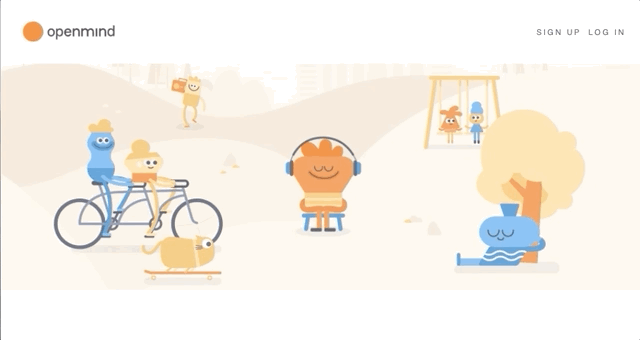

# Openmind README

<b>Openmind</b> is inspired by the popular meditation app Headspace. Openmind is a mindfulness webpage that allows a user to be completely immersed in their practice, by providing no distraction listening.
 
 
<a href="https://nw-openmind.herokuapp.com/">Visit the site</a>
 
 
Designed for macOS Catalina. <i>Not yet tested on older versions of macOS.</i>
 
 

 
 

## Technologies Used

- Ruby on Rails
- React / Redux
- HTML / CSS / Javascript
- Amazon Web Services (s3 Storage)

## Key Features

- No Distraction Play
In order for mindfulness to be encouraged, users are unable to continue listening upon exit of the modal.
This allows users to leave distractions behind them as they begin their practice.

- Timers
If users do not wish to participate in guided meditations, they can put their practice to the test.
Users have access to several timers that can help them keep accountable to their session.

## Coming Soon

- List CRUD
Users will be able to create personalized playlists, that they can add particular medtiations to.
Users can delete their playlists and the songs on them.

- Search
Users will be able to filter for meditations according to category.
Users will also be able to search for particular meditations based on name or category

- Dashboard
Active meditators will be able to view their stats and progress as their practice evolves.
Users will be able to view a timeline of previously listened to meditations and listen directly from that screen.

- Friendship
What fun is meditation without some friends along the way? Users will be able to not only
add their friends, but be able to send them a little love and motivation.
